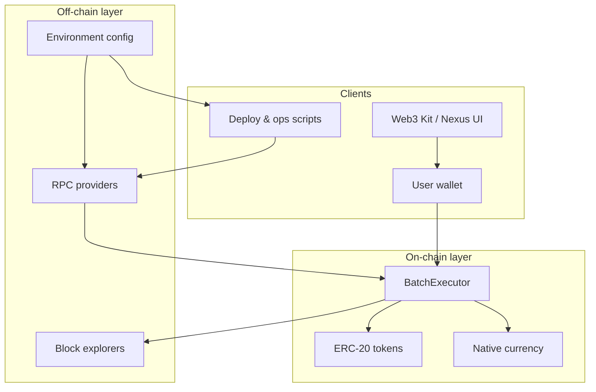
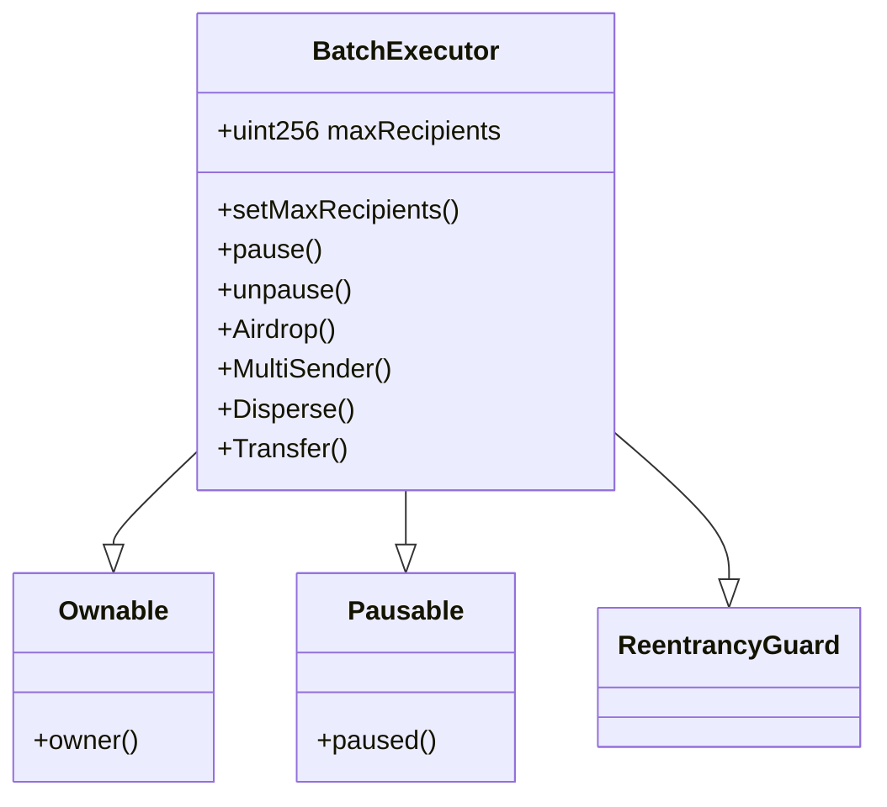
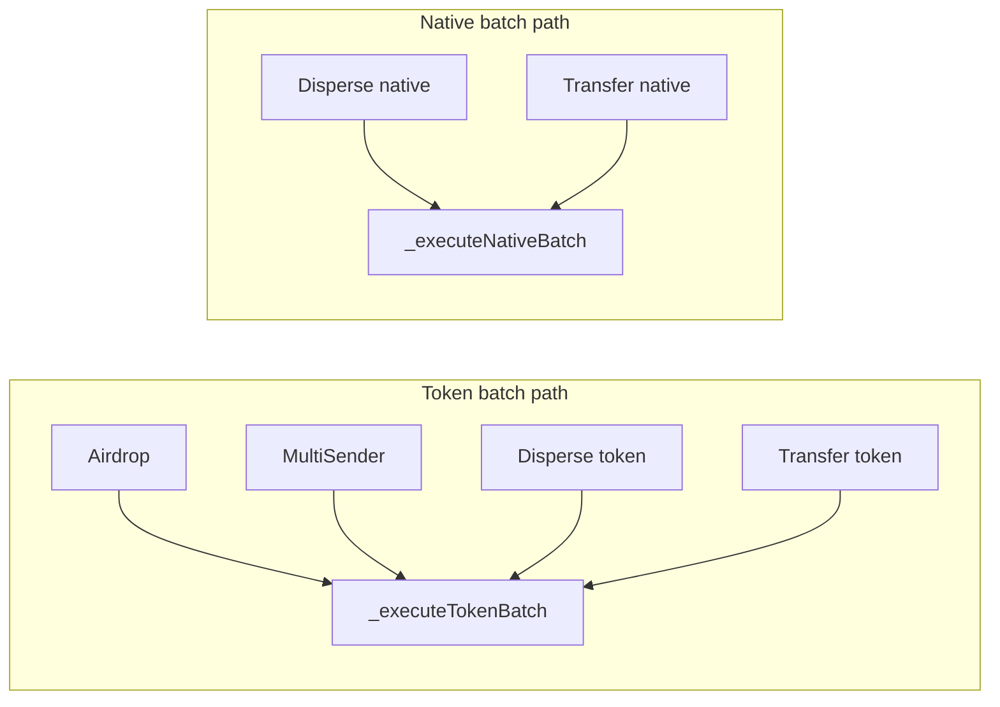
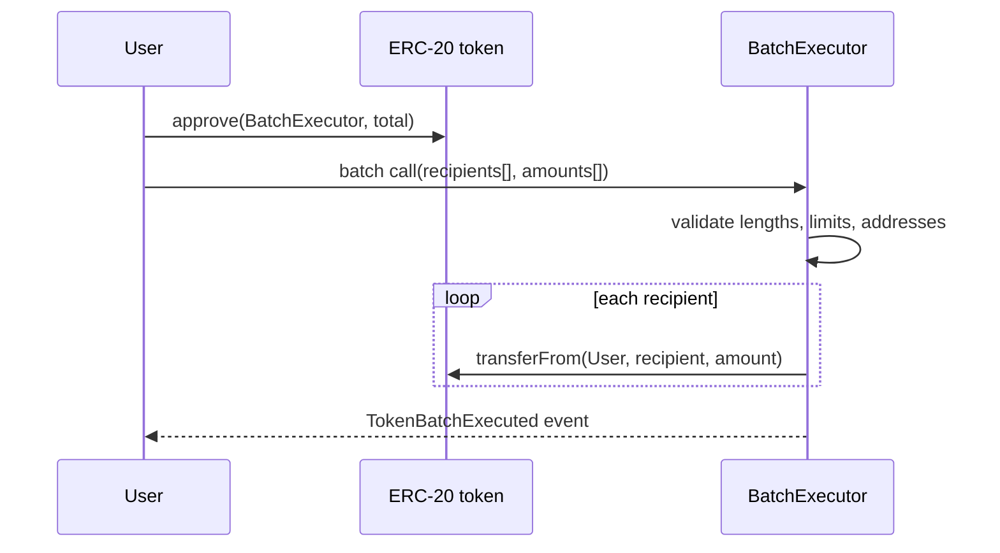
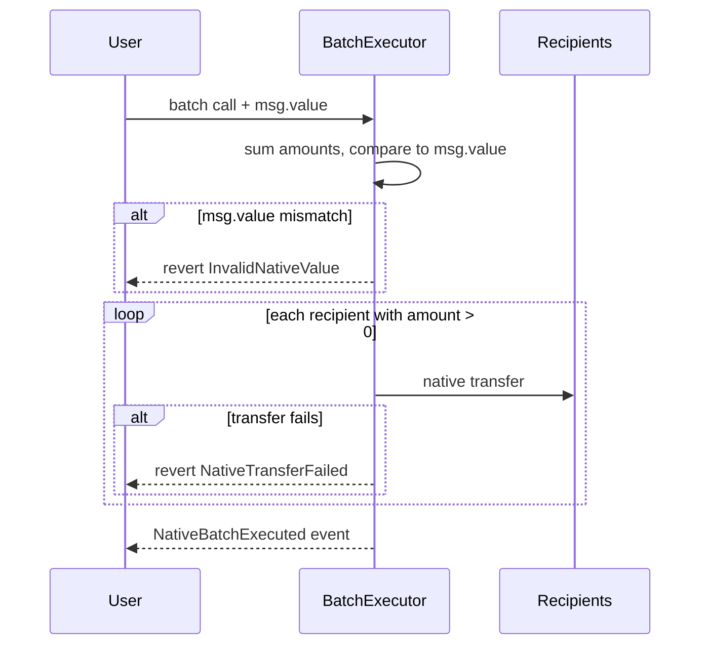
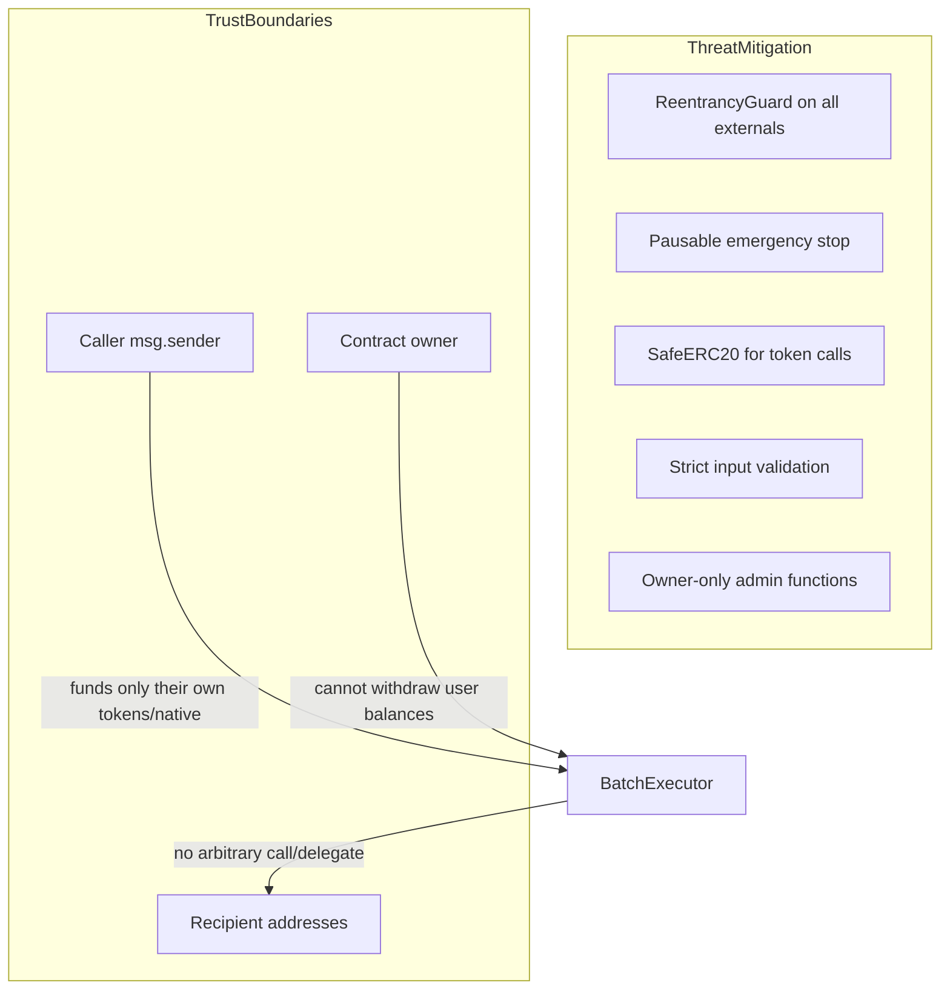
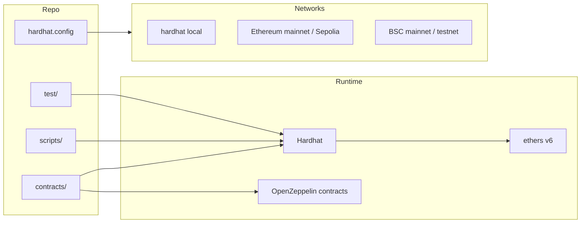
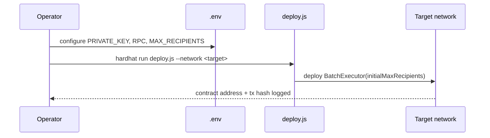

# Batch Executor — Project Brain

A on-chain batch transfer executor for ERC-20 tokens and native chain currency. One contract, one transaction: many recipients receive funds atomically from a single sender. Built for Web3 Kit / Nexus-style products that need explorer-friendly entry points, operational guardrails, and predictable gas behavior.

## Features

- **Single-transaction batch payouts** — Send to many recipients in one call instead of many separate transactions
- **ERC-20 and native support** — Distribute any standard token or chain-native currency (ETH, BNB, etc.)
- **Atomic execution** — The entire batch succeeds or reverts; no partial token transfers
- **Explorer-friendly aliases** — Public entry points named Airdrop, MultiSender, Disperse, and Transfer for clear block explorer labels
- **Configurable batch limits** — `maxRecipients` cap set at deploy and adjustable by the owner
- **Emergency pause** — Owner can pause all batch operations when needed
- **Reentrancy protection** — Every external batch function is guarded against reentrancy
- **Safe token transfers** — Uses OpenZeppelin SafeERC20 for reliable ERC-20 handling
- **Rich on-chain events** — Emits indexed events for token and native batches for easy indexing and analytics
- **Multi-network ready** — Hardhat setup for Ethereum (mainnet, Sepolia) and BSC (mainnet, testnet)
- **Deploy and verify tooling** — Scripts with constructor-aware verify command output
- **Test coverage** — Automated tests for token batch, native batch, validation, and recipient limits

This document is the **project brain**: purpose, architecture, behavior, operations, and design rationale — without implementation code.

---

## 1. Purpose and scope

### Problem

Distributing tokens or native currency to many addresses usually means many separate transactions. That costs more gas, increases failure surface, and complicates UX for airdrops, payroll, rewards, and treasury disbursements.

### Solution

**BatchExecutor** is a single smart contract that:

- Accepts one call with parallel arrays of recipients and amounts
- Moves ERC-20 tokens via `transferFrom` (sender must approve first)
- Moves native currency (BNB, ETH, etc.) via a single `msg.value` that must equal the sum of amounts
- Enforces batch size limits, pause controls, and reentrancy protection
- Exposes multiple **public function aliases** so block explorers and frontends can show familiar names (Airdrop, MultiSender, Disperse, Transfer)

### Out of scope

- No token minting, staking, or vesting
- No fee collection or routing logic inside the contract
- No off-chain indexing service (events are emitted for external indexers)
- MockToken exists only for local testing, not production deployment

---

## 2. High-level architecture

### Architectural principles

| Principle | How it is applied |
|-----------|-------------------|
| **Single responsibility** | Contract only batches transfers; no business logic beyond validation and safety |
| **Fail fast** | Invalid input reverts the entire batch — no partial silent failures for token paths |
| **Explicit trust** | Token sends pull from `msg.sender`; native sends require exact `msg.value` |
| **Operational control** | Owner can pause, adjust `maxRecipients`, but cannot seize user funds |
| **Explorer ergonomics** | Duplicate entry-point names map to the same internal execution paths |

---

## 3. On-chain component design

### 3.1 BatchExecutor — core contract

**Inherited capabilities (OpenZeppelin)**

- **Ownable** — deployment account becomes owner; only owner updates limits and pause state
- **Pausable** — global emergency stop; all batch entry points respect `whenNotPaused`
- **ReentrancyGuard** — `nonReentrant` on every external batch function
- **SafeERC20** — safe token transfers with standard-compliant error handling

**Configurable state**

- `maxRecipients` — upper bound on array length per batch; set at deploy time, adjustable by owner

**Events (indexer / analytics surface)**

- `TokenBatchExecuted` — sender, token, recipient count, total amount
- `NativeBatchExecuted` — sender, recipient count, total amount
- `MaxRecipientsUpdated` — previous and new limit

### 3.2 Public API surface (aliases)

All aliases are thin wrappers over two private execution paths. Naming supports block explorer readability and product vocabulary — not different behavior.

| Entry name | Asset type | Sender funding model |
|------------|------------|----------------------|
| Airdrop | ERC-20 | Approve contract, then call |
| MultiSender | ERC-20 | Same as Airdrop |
| Disperse (token overload) | ERC-20 | Same as Airdrop |
| Transfer (token overload) | ERC-20 | Same as Airdrop |
| Disperse (native overload) | Native | Send `msg.value` = sum of amounts |
| Transfer (native overload) | Native | Send `msg.value` = sum of amounts |

---

## 4. Execution flows

### 4.1 ERC-20 batch flow

**Behavioral rules**

- `token` address must be non-zero
- `recipients.length` must equal `amounts.length`
- Length must be between 1 and `maxRecipients` inclusive
- No zero-address recipients
- Entire transaction reverts if any `transferFrom` fails (insufficient allowance, balance, etc.)
- Zero amounts are allowed per recipient (still iterates; no skip logic on token path)

### 4.2 Native batch flow

**Behavioral rules**

- `msg.value` must exactly equal the sum of all amounts (no overpay, no underpay)
- Zero-amount entries are skipped for the actual send loop (gas optimization)
- Failed low-level native transfers revert with recipient and amount context

---

## 5. Validation and error model

Custom errors (gas-efficient, explicit) cover every guard:

| Error | Trigger |
|-------|---------|
| InvalidLength | Recipients and amounts arrays differ in length |
| ZeroRecipients | Empty batch or zero `maxRecipients` |
| TooManyRecipients | Batch length exceeds `maxRecipients` |
| ZeroAddressRecipient | Any recipient is `address(0)` |
| ZeroTokenAddress | Token address is zero on ERC-20 path |
| InvalidNativeValue | `msg.value` ≠ sum of native amounts |
| NativeTransferFailed | Low-level send to recipient failed |

**Atomicity**: one failed validation or transfer reverts the whole transaction. No state is partially committed.

---

## 6. Security architecture

| Concern | Mitigation |
|---------|------------|
| Reentrancy during native sends | `nonReentrant` modifier |
| Malicious token contracts | SafeERC20; still subject to token-specific quirks |
| Admin abuse | Owner can pause or change limits only — no fund withdrawal hook |
| Oversized batches / griefing | `maxRecipients` cap |
| Wrong native payment | Exact `msg.value` check before any sends |
| Explorer / UX confusion | Aliases share one implementation — no hidden code paths |

**Residual risks (documented, not hidden)**

- Owner can pause the contract (availability risk)
- Owner can lower `maxRecipients` (operational constraint change)
- Smart contract wallets or contracts that reject native transfers may cause `NativeTransferFailed`
- ERC-20 tokens with fees-on-transfer or rebasing behavior are not specially handled

---

## 7. Off-chain and toolchain architecture

### 7.1 Repository roles

| Area | Role |
|------|------|
| **contracts/BatchExecutor.sol** | Production contract |
| **contracts/MockToken.sol** | Test-only ERC-20 fixture |
| **scripts/deploy.js** | Deploy BatchExecutor with configurable `maxRecipients` |
| **test/test.js** | Behavioral coverage for token batch, native batch, validation, limits |
| **hardhat.config.js** | Solidity 0.8.28, optimizer, network definitions, gas reporter, explorer keys |
| **env.example** | Template for secrets and RPC URLs — copy to `.env` |

### 7.2 Supported networks

| Network key | Chain | Typical use |
|-------------|-------|-------------|
| hardhat | Local | Development and automated tests |
| sepolia | Ethereum testnet | Pre-mainnet Ethereum testing |
| mainnet | Ethereum | Production Ethereum |
| bscTestnet | BNB Smart Chain testnet | Pre-mainnet BSC testing |
| bscMainnet | BNB Smart Chain | Production BSC |

Package scripts ship for BSC deploy targets; other networks are configured and usable via Hardhat CLI with the matching `--network` flag.

### 7.3 Environment configuration

Configuration is loaded from `.env` (never committed). See `env.example` for the full variable list.

| Variable group | Purpose |
|----------------|---------|
| **PRIVATE_KEY** | Deployer / transaction signer for live networks |
| **RPC URLs** | Per-network JSON-RPC endpoints |
| **BSCSCAN_API_KEY** | Contract verification on BSC explorers |
| **MAX_RECIPIENTS** | Initial on-chain batch limit at deploy (default 200) |

### 7.4 Build and quality tooling

- **Solidity 0.8.28** with optimizer enabled (200 runs) — balance of deploy size and runtime gas
- **hardhat-gas-reporter** — gas visibility during tests
- **@nomicfoundation/hardhat-toolbox** — compile, test, verify, and network tooling bundle

---

## 8. Deployment architecture

**Deploy-time decisions**

- Deployer becomes **owner** (Ownable `msg.sender` at construction)
- `initialMaxRecipients` is immutable intent at launch but owner can update later via `setMaxRecipients`
- No proxy / upgrade pattern — deployed bytecode is final for that address

**Post-deploy checklist**

1. Verify contract on the target block explorer
2. Record deployed address and initial `maxRecipients`
3. Communicate address to frontend / Web3 Kit integration
4. Confirm pause policy and owner key custody

---

## 9. Integration guide (for product / frontend)

### Sender prerequisites

**Token batch**

1. User holds sufficient token balance
2. User approves BatchExecutor for at least the **sum** of all amounts in the batch
3. User submits batch transaction through any alias (Airdrop, MultiSender, Disperse, Transfer)

**Native batch**

1. User computes total = sum of amounts
2. User submits batch transaction with `value` = total exactly

### Function selection for explorers

Use the alias that best matches user-facing language. Behavior is identical within token vs native families. Overloaded names (Disperse, Transfer) are distinguished by argument types: token address present → ERC-20 path; only arrays → native path.

### Indexing

Subscribe to `TokenBatchExecuted` and `NativeBatchExecuted` for analytics, receipts, and activity feeds. Indexed fields include sender and (for tokens) token address.

---

## 10. Testing philosophy

Tests run on the local Hardhat network with a deployed BatchExecutor and MockToken.

| Scenario | Expected outcome |
|----------|------------------|
| Valid ERC-20 batch | Balances updated; event emitted with correct aggregates |
| Valid native batch | Event emitted; correct total |
| Length mismatch | Revert `InvalidLength` |
| Wrong `msg.value` on native | Revert `InvalidNativeValue` |
| Batch over `maxRecipients` | Revert `TooManyRecipients` after owner lowers limit |

Tests assert **behavior and events**, not implementation internals — aligned with how integrators experience the contract.

---

## 11. Operational commands (reference)

| Intent | Command |
|--------|---------|
| Install dependencies | `npm install` |
| Compile contracts | `npm run compile` |
| Run test suite | `npm test` |
| Deploy to BSC testnet | `npm run deploy:bscTestnet` |
| Deploy to BSC mainnet | `npm run deploy:bscMainnet` |
| Gas report during tests | Set `REPORT_GAS=true` when running tests |

Ensure `.env` is populated from `env.example` before any network deploy.

---

## 12. Design decisions log

| Decision | Rationale |
|----------|-----------|
| Multiple public aliases | Explorer and marketing-friendly labels without duplicate logic |
| Private execution helpers | One validation and transfer implementation; reduces audit surface |
| Owner-adjustable `maxRecipients` | Ops can react to gas limits or abuse without redeploying |
| Pausable | Emergency stop for incidents; explicit tradeoff vs immutability |
| No upgrade proxy | Simplicity and trust minimization for a transfer utility |
| Exact `msg.value` for native | Prevents stuck ETH in contract from overpayment |
| Custom errors over strings | Lower gas, clearer revert data for tooling |
| Default 200 max recipients | Sensible batch size for deploy; tunable per environment |

---

## 13. Glossary

| Term | Meaning |
|------|---------|
| **Batch** | Single transaction distributing to N recipients |
| **Alias** | Public function name sharing the same execution path |
| **Native** | Chain native currency (ETH, BNB, etc.) |
| **Owner** | Deployer-controlled admin role (pause, limits) |
| **Sender** | `msg.sender` — the account whose tokens or native currency is distributed |
| **maxRecipients** | On-chain cap on array length per call |

---

## 14. Document maintenance

Update this README when:

- New networks or deploy scripts are added
- Public API aliases change
- Security assumptions or owner capabilities change
- Integration requirements for Web3 Kit / Nexus evolve

This file is the canonical **architecture and behavior** reference. Implementation details live in the contracts and scripts; this brain explains **what the system is, how it is shaped, and why it is shaped that way**.
